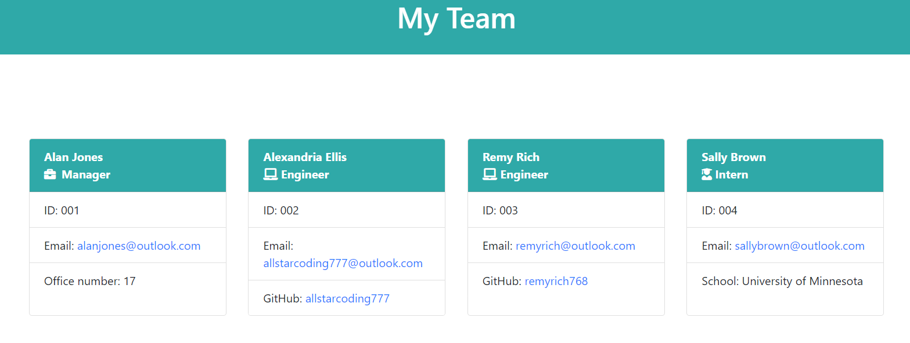

# team-profile-generator
  by allstarcoding777
  
  * ## Description
  This application automatically generates a team webpage based on user input. The team can include a manager, engineers, and interns.
  * ## Usage
  Open code in terminal. Type node index.js to begin generating a team file. A user will be prompted with various questions they will need to answer.
  
  
  
  * ## Demo
  Check out my demonstration of this app [HERE](https://drive.google.com/file/d/1ybOKFnhnoG5x72bCUNHroMNXVJGVtzQk/view)
  * ## Github Repository
  https://github.com/allstarcoding777/team-profile-generator
  * ## License
  This project is licensed under the MIT license.